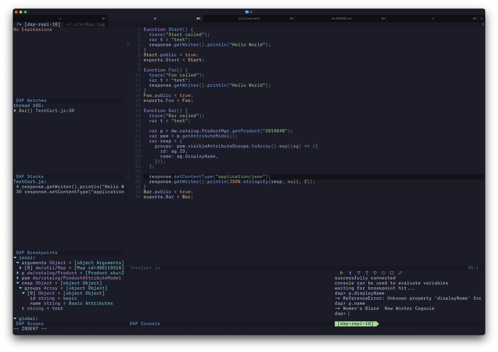

# nvim-sfcc

A Neovim plugin for Salesforce Commerce Cloud (SFCC) development.



## Features

- [x] DEBUGGER: [nvim-dap][1] extension that integrates the [Prophet][2] VSCode debug adapter into Neovim
- [x] LSP SUPPORT: a typescript language server plugin that resolves `*/...` and `~/...` style imports
  - See [LSP Configuration](#lsp-configuration)] for recommended project configuration
- [x] SYNTAX: basic ISML support
  - [x] `<isscript>` tags are highlighted as JS
  - [ ] unique ISML tag highlights
  - [ ] inline expression support

## TODO

- [ ] Automatic cartridge discovery for LSP plugin

### Out of Scope

- code/cartridge upload/watching
  - this is better handled by separate tools (see [sfcc-ci][3] or [b2c-tools][4]; b2c-tools has `code watch`, `code upload`, and `code download` commands)
- log viewing/tailing
  - see [b2c-tools][4] for a `tail` command
- SFCC types
  - Use your `tsconfig.json` or `jsconfig.json` and add types from [https://github.com/SalesforceCommerceCloud/dw-api-types](https://github.com/SalesforceCommerceCloud/dw-api-types) or [https://github.com/openmindlab/sfcc-dts/](https://github.com/openmindlab/sfcc-dts/). See [LSP Configuration](#lsp-configuration)

## Installation

### Dependencies

- [Neovim](https://neovim.io/)
- [Node.js](https://nodejs.org/en/) (recommend v16)
- [nvim-dap][1]

Optional:

- [nvim-dap-ui][5] - this is the UI seen in the screenshot above
- [Prophet][2] - this provides the debugger for SFCC. If requested this will be downloaded automatically.
- [nvim-lspconfig][6] - this is used to provide LSP support

### Plugin

Use your favorite plugin manager to install an configure plugin. You must specify one of `prophet_auto_download` or `prophet_debug_adapter`. For example, with lazy.nvim:

```lua
{ 
  "clavery/nvim-sfcc", 
  dependencies = {"mfussenegger/nvim-dap", "neovim/nvim-lspconfig"},
  ---@module "sfcc"
  ---@type sfcc.setup.opts
  opts = { 
    -- auto download the latest version of Prophet
    prophet_auto_download = true
    -- OR configure the path to the Prophet debug adapter you built yourself from source
    -- prophet_debug_adapter = "/path/to/prophet/dist/mockDebug.js",

    -- (optional) configure to location to nodejs; default to `node` on your path
    --node_path = "/path/to/node",

    -- (optional) include default Sandbox Attach configuration (in lieu of a .vscode/launch.json)
    --include_configs = false
  }
}
```

## Usage

Make sure you have a `dw.json` or `dw.js` file in your working directory. If `dw.js` is found it will be excuted using nodejs (via `node_path` configuration option) and the module exports will be parsed as JSON as if it was a `dw.json` file (this is the same behavior as Prophet). Note you can use the multiple instances convention in the style of [b2c-tools][4].

```json
{
  "name": "default",
  "active": true,
  "hostname": "abcd-001.dx.commercecloud.salesforce.com",
  "username": "...",
  "password": "...",
  "code-version": "version1",
  "configs": [{
    "name": "sandbox002",
    "active": false,
    "hostname": "abcd-002.dx.commercecloud.salesforce.com",
    "username": "...",
    "password": "...",
    "code-version": "version1",
  }]
}
```

Add at least 1 `.vscode/launch.json` configuration to your project (see that you can override `dw.json` keys here; for instance, to reference an alternate config). Note this should work with existing VSCode prophet launch configurations.

```json
{
  "configurations": [
    {
      "type": "prophet",
      "request": "launch",
      "name": "Attach to Sandbox"
    },
    {
      "type": "prophet",
      "request": "launch",
      "name": "Attach to Sandbox abcd-002 alt Code Version",
      "sfcc": {
        "instance": "sandbox002",
        "code-version": "version2"
      }
    }
  ]
}
```

Then, start the debug adapter using the normal DAP commands. (see [nvim-dap][1] for more information on configuration and keybindings)

```vim
:lua require('dap').continue()
```

## LSP Configuration

Requires: [nvim-lspconfig][6] or another TS LSP client.

This plugin includes a typescript-language-server plugin for resolving SFCC-style imports. `*/...` imports will
be translated to a `@cartridges/*` path.  To configure for nvim-lspconfig:

```lua
local lspconfig = require('lspconfig')
lspconfig.ts_ls.setup({
  --- ...
  init_options = {
    plugins = {
      {
        name = "sfcc-resolver",
        location = require('sfcc').resolver_plugin_path
      },
    },
  },
})
```

You can use your `tsconfig.json` to configure where these should resolve to. For example here we configure a "cartridge path" to resolve `*/...` style imports to the app_mysite and app_storefront_base cartridges. This example also references the [dw-api-types](https://github.com/SalesforceCommerceCloud/dw-api-types) to provide SFCC API types. `~/...` style imports will be resolved by the plugin to the containing cartridge.

```json
{
  "compilerOptions": {
    "baseUrl": ".",
    "types": [
      "node",
      "axios",
      "./tools/dw-api-types/dw/global.d.ts"
    ],
    "paths": {
      "*": [
        "dependencies/storefront-reference-architecture/cartridges/modules/*"
      ],
      "dw/*": [
        "tools/dw-api-types/dw/*"
      ],
      "@cartridges/*": [
        "cartridges/app_mysite/*",
        "dependencies/storefront-reference-architecture/cartridges/app_storefront_base/*"
      ]
    }
  }
}
```


## Issues

- Typescript < v5.0.0 is not supported
  - if you have typescript installed in your project the typescript-language-server use that version. Our SFCC resolver plugin is for TS 5 and above and won't be attached on older versions
- `<isscript>` tags stop highlighting when a `<` char is encountered


## Support

Open a github issue for any issues. DO NOT open an issue with Prophet unless you find a bug that can be reproduced using VSCode.

This project should not be treated as Salesforce Product. Customers and partners use this at-will with no expectation of roadmap, technical support, defect resolution, production-style SLAs.

This project is maintained by the Salesforce Community. Salesforce Commerce Cloud or Salesforce Platform Technical Support do not support this project or its setup.

THE SOFTWARE IS PROVIDED "AS IS", WITHOUT WARRANTY OF ANY KIND, EXPRESS OR IMPLIED.


[1]: https://github.com/mfussenegger/nvim-dap
[2]: https://github.com/SqrTT/prophet/
[3]: https://github.com/SalesforceCommerceCloud/sfcc-ci
[4]: https://github.com/SalesforceCommerceCloud/b2c-tools
[5]: https://github.com/rcarriga/nvim-dap-ui
[6]: https://github.com/neovim/nvim-lspconfig

